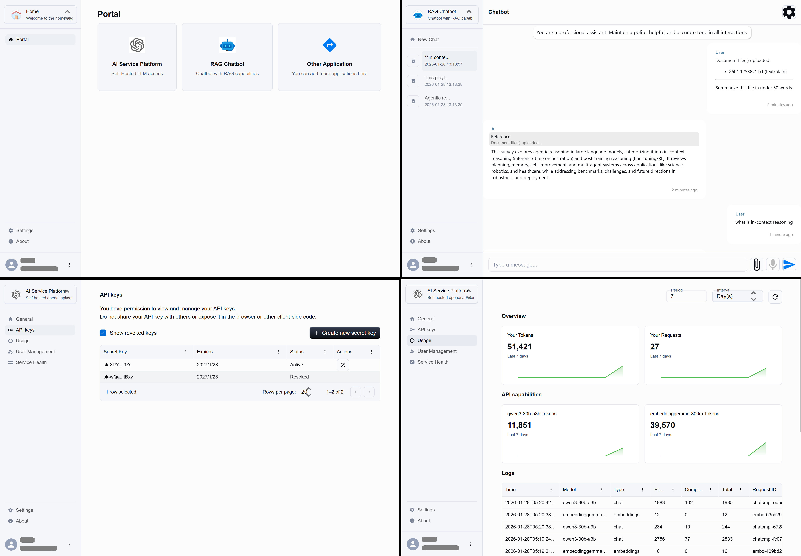
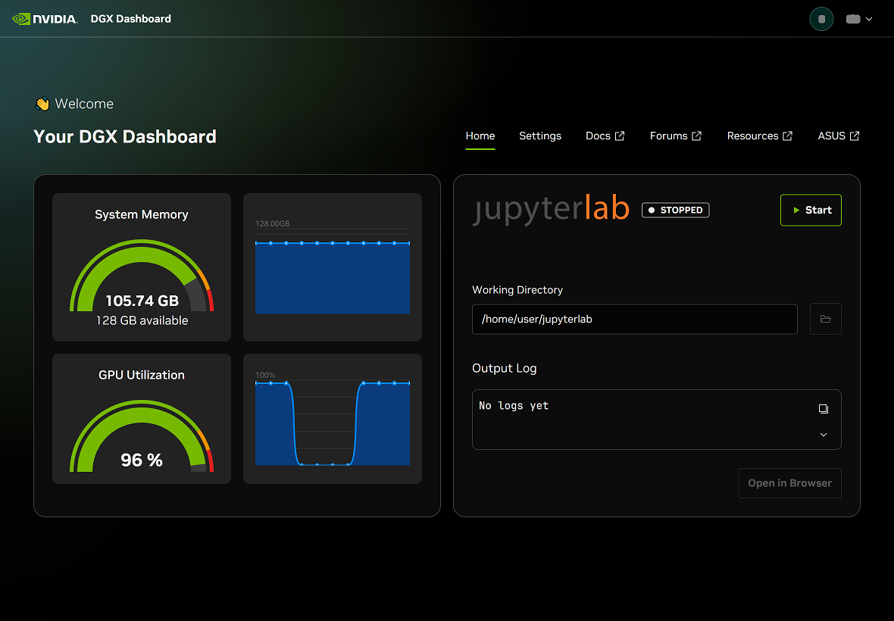

# OpenAI-Compatible Frontend

A self-hosted OpenAI-compatible API server with user/API-key management, token-based authentication, and RAG chatbot using PostgreSQL/pgvector. Supports dev/prod via Docker Compose, Nginx, Triton servers, SSL/TLS, and designed for Asus Ascent GX10 and NVIDIA Spark DGX GB10 servers.

<p align="center">
   
   <br>
   <em>A preview of the modern, responsive Web UI featuring user management, usage analytics, and seamless interaction with AI models.</em>
</p>
<p align="center">
   
   <br>
   <em>Dashboard view from the Asus Ascent GX10 server, showcasing real-time resource monitoring and API serving status.</em>
</p>

## Features

- **OpenAI API Compatibility**: Full OpenAI API v1 support for chat and embeddings
- **Web Interface**: Modern React-based UI for easy interaction
- **Multi-Model Support**: Support for various AI models (Qwen, Gemma, etc.)
- **User Management**: Authentication and API key management
- **Usage Tracking**: Comprehensive usage monitoring and analytics
- **Docker Deployment**: Complete containerized setup for dev/prod
- **Database Integration**: PostgreSQL with vector support

## Quick Start

### Prerequisites
- Docker and Docker Compose
- SSL certificates (self-signed or from a CA) for nginx

### Development Setup

1. **Clone and setup environment:**
   ```bash
   git clone https://github.com/HoHuiHsieh/Private-AI-Frontend-Suite
   cd Private-AI-Frontend-Suite
   cp .env.dev.example .env.dev  # Configure your environment
   ```

2. **Download models (optional):**
This step will create a `hf_env/` virtual environment and download the required AI models (Qwen3-30B-A3B and Gemma-300M) from Hugging Face into the local cache.

   ```bash
   ./download.sh
   ```

3. **Start development environment:**
   ```bash
   ./start.sh dev
   ```

4. **Develop in Containers:**
Access the containers for server and webui development.


### Production Deployment

1. **Configure production environment:**
   ```bash
   cp .env.prod.example .env.prod  # Configure production settings
   ```

2. **Start production environment:**
   ```bash
   ./start.sh prod
   ```

The application will be available at:
- **Web UI**: https://your-domain/webui/
- **Web API**: https://your-domain/api/
- **OpenAI-compatible API**: https://your-domain/v1/


## Project Structure

```
├── docker/                # Docker configurations
├── nginx/                 # Nginx configurations
├── postgres/              # PostgreSQL setup
├── server/                # FastAPI backend server
│   ├── src/               # Source code
│   ├── specs/             # API specifications
│   └── README.md          # Server documentation
├── share/                 # Shared resources
├── triton_repo/           # Triton inference servers
├── webui/                 # Next.js frontend
│   ├── src/               # React application
│   ├── spec/              # Component specifications
│   └── README.md          # WebUI documentation
├── docker-compose.yml     # Multi-service orchestration
├── download.sh            # Model download script
├── LICENSE
├── model.yml              # Model configurations
├── README.md              # This file
└── start.sh               # Environment startup script
```

## Supported Models

### Chat Models
- **Qwen/Qwen3-30B-A3B-Instruct-2507**: High-performance chat model

### Embedding Models
- **google/embeddinggemma-300m**: Efficient embedding model

### Audio Models
- Coming soon...

## Configuration

### Environment Variables
- **Database**: PostgreSQL connection settings
- **Authentication**: JWT and OAuth2 configuration
- **Models**: AI model endpoints and configurations
- **Logging**: Log levels and destinations

### Model Configuration
Models are configured in `model.yml` with:
- Host and port settings
- API compatibility types
- Response formatting

## Development

### Local Development (containers)
- **Server**: `cd /workspace/server && python -m src.main`
- **WebUI**: `cd /workspace && npm run dev`
- **Database**: PostgreSQL with pgvector extension

### Testing
- **Server**: `cd /workspace/server && pytest`
- **WebUI**: `cd /workspace && npm run lint`

### Building
- **Server**: Docker build with multi-stage setup
- **WebUI**: `cd /workspace && npm run build` (static export)
## API Endpoints

### OpenAI Compatible
- `GET /v1/models` - List available models
- `POST /v1/chat/completions` - Chat completions
- `POST /v1/embeddings` - Text embeddings
- `POST /v1/audio/transcriptions` - Audio transcription

### Management
- `POST /api/login` - User authentication
- `GET /api/apikeys` - API key management
- `GET /api/usage/overview` - Usage statistics

## Deployment

### Docker Compose Profiles
- **dev**: Development environment with hot reload
- **prod**: Production environment with optimizations

### Services
- **nginx**: Reverse proxy and static file serving
- **server**: FastAPI application server
- **webui**: Next.js static build
- **postgres**: Database with vector extensions
- **inference servers**: AI model serving containers

## Documentation

- **[Server API Docs](server/README.md)**: Backend API documentation
- **[WebUI Docs](webui/README.md)**: Frontend documentation
- **[Server Specs](server/specs/)**: Detailed API specifications
- **[WebUI Specs](webui/spec/)**: Component specifications

## License

See LICENSE.txt for licensing information.